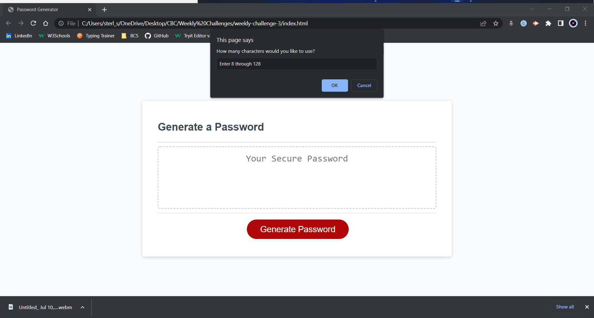
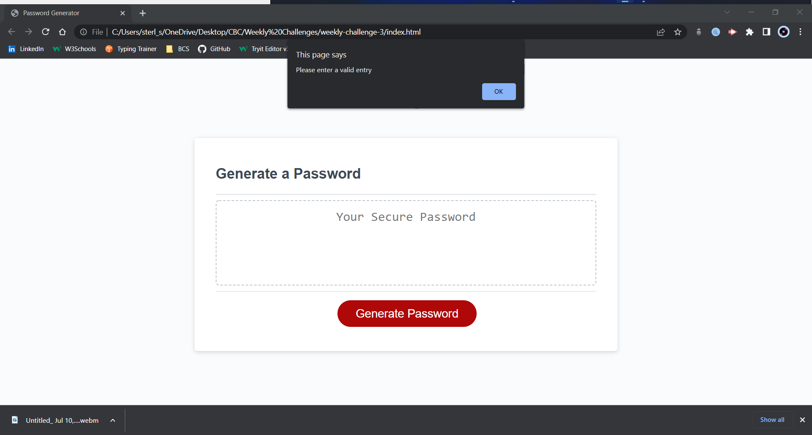
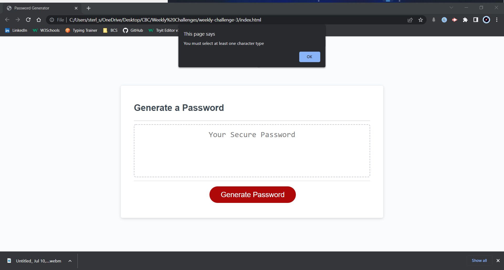
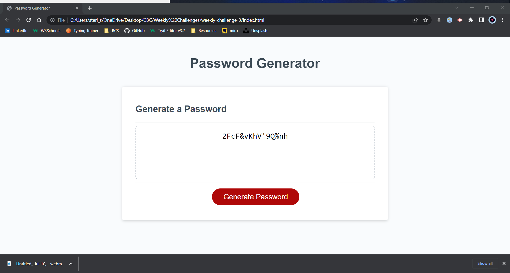

# Robert (Scott) Sterling - Password Generator

## Description

This application utilizes HTML, CSS, and Javascript to generate a random, secure password for a user.

### Summary

This program features a generate button that, when clicked, sends the user a series of prompts and confirms that set parameters for what the password will contain.

There is validation in place to make sure that the user follows the guidelines set in place. For example, if the user enters too few or too many characters in the initial prompt, the program will ask them to try again.

If the user does not enter any OKs in the confirm boxes, the program will alert them that they need to choose at least one parameter.

Once a password has been generated, it will diplay in the text area.

#### File Features

- One HTML file (index.html), which contains divs for creating the password generating text area, as well as a button to get the process started.
- One CSS file (style.css), which contains code for styling the text, card, and button, as well as media queries for responsive design.
- One JavaScript file (script.js), which contains variables for functions and references to target elements in the HTML, as well as one event listener, two while loops, and several if statements.

##### Watch it in action!

You can watch a demo here:

